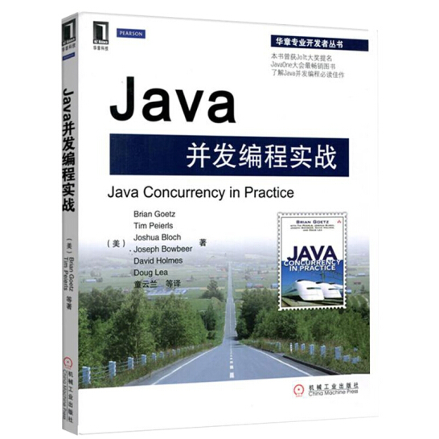

# JavaConcurrencyInPracticeReadingNotes
  
《Java并发编程实战》图书主页：<https://jcip.net/>  
《Java并发编程实战》笔记
# [第1章 简介](./notes/第01章 简介.md)
# [第2章 线程安全性](./notes/第02章 线程安全性.md)
# [第3章 对象的共享](./notes/第03章 对象的共享.md)
# [第4章 对象的组合](./notes/第04章 对象的组合.md)
# [第5章 基础构建模块](./notes/第05章 基础构建模块.md)
# [第6章 任务执行](./notes/第06章 任务执行.md)
# [第7章 取消与关闭](./notes/第07章 取消与关闭.md)
# [第8章 线程池的使用](./notes/第08章 线程池的使用.md)
# [第9章 线程池的使用](./notes/)
# [第10章 线程池的使用](./notes/)
# [第11章 线程池的使用](./notes/)
# [第12章 线程池的使用](./notes/)
# [第13章 线程池的使用](./notes/第13章 显示锁.md)
# [第14章 线程池的使用](./notes/第14章 构建自定义的同步工具.md)
# [第15章 线程池的使用](./notes/第15章 原子变量与非阻塞同步机制.md)
# [第16章 线程池的使用](./notes/第16章 Java内存模型.md)

